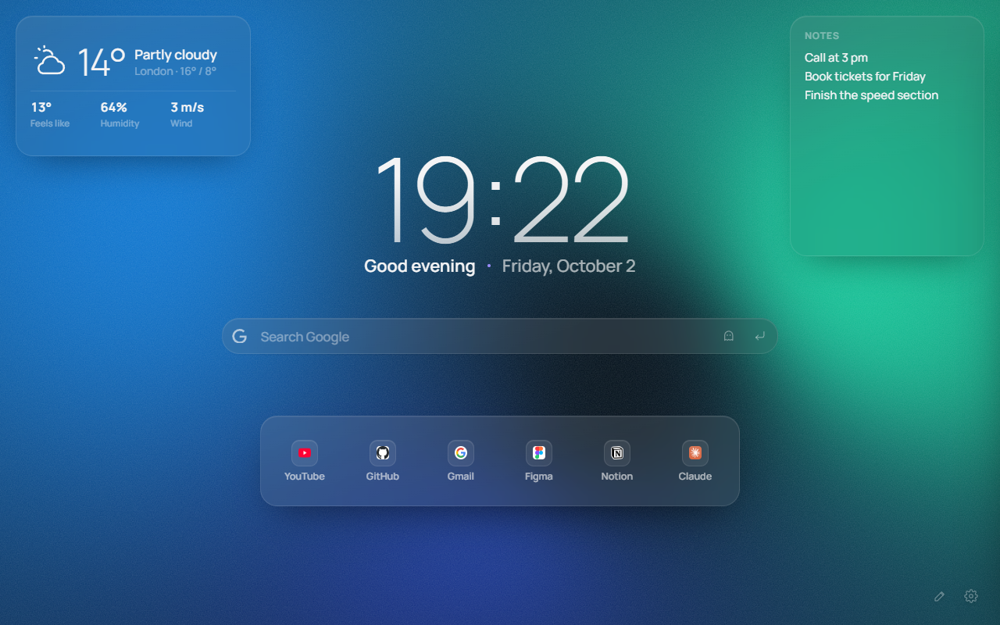

<p align="center"></p>

<h1 align="center">Torii</h1>

<p align="center">A new tab with a free-form layout: drag and resize widgets anywhere.<br>
Новая вкладка со свободной раскладкой: двигай и растягивай виджеты как хочешь.</p>

<p align="center"><a href="https://dvmnum.github.io/torii">Website</a> · <a href="https://dvmnum.github.io/torii/privacy.html">Privacy</a> · <a href="CHANGELOG.md">Changelog</a></p>



## Features

- **Free-form layout** — widgets aren't stuck in one centered column: drag them anywhere, resize from any corner. Separate layouts for wide monitors and laptops.
- **17 widgets** — clock, greeting, search (bangs like `!yt`, calculator, incognito), links, top sites, bookmarks bar, weather (now / details / hourly / week), notes, to-dos, habits, pomodoro, countdown, exchange rates, quote, word of the day, picture, recently closed tabs.
- **Live backgrounds** — animated WebGL gradients, 14 presets, your own image with effects (frosted glass, reeded, halftone, duotone), slideshow.
- **Glass** — frosted widgets that adapt to the background; "liquid glass" with refraction in Chromium.
- **Saved layouts** — several versions of your new tab, each with its own widgets and style, switched with Alt+1…9.
- **Fast and private** — opens in ~80 ms, no ads, no analytics, everything stays in the browser. English and Russian UI.

## Install

Chrome Web Store (also for Edge, Yandex Browser, Opera, Brave, Vivaldi) and Firefox Add-ons — coming soon. Links will be on the [website](https://dvmnum.github.io/torii).

From source: `chrome://extensions` → Developer mode → **Load unpacked** → the `plitka/` folder.

## Development

Vanilla JS and CSS, no build step and no frameworks: the files in `plitka/` are loaded as is (Manifest V3).

```bash
npm i
npx playwright install chromium firefox
npm test               # e2e smoke test in Chromium (screenshots → tests/shots/)
npm run test:firefox   # smoke test in the Firefox engine
npm run perf           # load time and long tasks
npm run i18n           # Russian strings missing an English translation
npm run build          # store packages → dist/torii-<version>-chrome.zip / -firefox.zip
npm run store          # store screenshots → store/screenshots/
npm run site           # website images → site/img/  (then npm run site:serve)
```

Project notes for contributors live in [`CLAUDE.md`](CLAUDE.md) (in Russian): data model, widget API, gotchas.

## How it's made

Torii is built with [Claude Code](https://claude.com/claude-code). The idea, design and every product decision are by [@dvmnum](https://github.com/dvmnum); most of the code was written by Claude.

## Support

Torii is free and ad-free. If you like it, you can [support the author on Boosty](https://boosty.to/dvmnum/donate).

## License

Copyright © 2026 dvmnum. [GPL-3.0](LICENSE): you can use, change and share Torii, but forks and modified versions must stay open source under the same license. Versions up to 0.12.4 were also released under MIT. Bundled fonts (Manrope, Unbounded, Playfair Display, Oswald, Comfortaa, Caveat, Lobster) are under the SIL Open Font License; search engine and browser logos are from Simple Icons (CC0) and Font Awesome (CC BY 4.0); outline icons in the widget catalog are from Lucide (ISC); the grid is [gridstack.js](https://github.com/gridstack/gridstack.js) (MIT).
